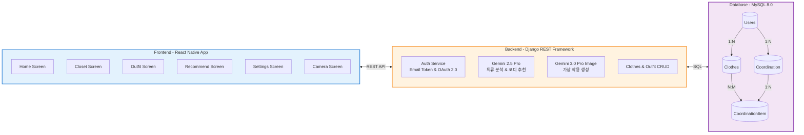
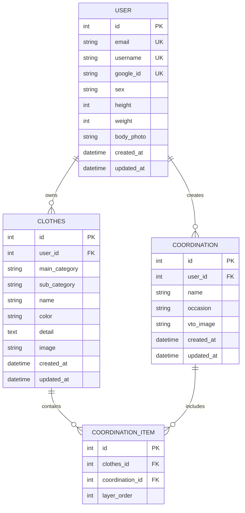

# Orbit

AI 기반 패션 코디네이션 및 가상 착용 시뮬레이터를 제공하는 모바일 애플리케이션입니다. 사용자의 옷장을 디지털화하고, 날씨와 일정 데이터를 분석하여 최적의 코디를 추천합니다. Google Gemini AI를 활용한 의류 상세 분석, 스타일 추천, 가상 착용 이미지 생성 기능을 통해 개인 맞춤형 패션 경험을 제공합니다.

## Screenshots

| 홈 (날씨·일정 기반 추천) | AI 추천 상세 | 가상 착용 결과 |
|:---:|:---:|:---:|
|  |  |  |
| **홈 — 데일리 룩 카드** | **코디 상세 (가상 착용)** | **스타일 로그** |
|  |  |  |

가상 착용 이미지는 사용자의 전신 사진과 옷장 속 실제 의류를 Gemini 이미지 생성 모델로 합성한 결과물입니다.
캡스톤디자인 결과보고서(발표자료)는 [`docs/`](docs/)에 있습니다.

## Table of Contents

- [Tech Stack](#tech-stack)
- [Key Features](#key-features)
- [Architecture](#architecture)
- [Database Schema](#database-schema)
- [Getting Started](#getting-started)
- [Project Structure](#project-structure)

## Tech Stack

### Frontend

**Language & Framework**
- TypeScript 5.8.3
- React 19.0.0
- React Native 0.79.5
- Expo SDK 53

**State Management**
- Redux Toolkit 2.9.0
- React Redux 9.2.0

**Navigation**
- React Navigation 6.x (Native Stack, Bottom Tabs, Stack)

**UI & Animation**
- React Native Reanimated 3.17.4
- Expo Linear Gradient 14.1.5
- React Native Community Blur 4.4.1
- Expo Blur 14.1.5
- React Native Gesture Handler 2.24.0

**Image & Media**
- Expo Image 2.4.1
- Expo Image Picker 16.1.4
- React Native Vision Camera 4.7.2
- React Native SVG 15.14.0

**Storage & Cache**
- AsyncStorage 2.2.0

**Utilities**
- Axios 1.13.2
- Expo Location 18.1.6
- Expo Network 7.1.5
- React Native Worklets Core 1.6.2

### Backend

**Language & Framework**
- Python 3.9+
- Django 4.x
- Django REST Framework

**Database**
- MySQL 8.0

**AI Services**
- Google Gemini 2.5 Pro (의류 상세 분석 및 코디 추천)
- Google Gemini 3.0 Pro Image Preview (가상 착용 이미지 생성)

**Image Processing**
- Pillow (Python Imaging Library)

**Authentication**
- Google OAuth 2.0
- Email-based Token Authentication

### Infrastructure

**Hosting**
- GCP Compute Engine + Django Admin Interface

**Development Tools**
- Expo Dev Client 5.2.4
- TypeScript Compiler
- Babel 7.25.2
- NativeWind 2.0.11 (Tailwind CSS for React Native)

## Key Features

### AI 기반 코디 추천
- **날씨 기반 추천**: 실시간 날씨 데이터(온도, 체감온도, 습도, 날씨 상태)를 분석하여 기후에 적합한 옷차림 제안
- **일정 기반 추천**: 캘린더 이벤트를 분석하여 TPO(Time, Place, Occasion)에 맞는 코디 추천
- **스타일 선호도 반영**: 사용자가 입력한 스타일 선호도를 AsyncStorage에 캐싱하고 추천 알고리즘에 적용
- **AI 통합 추천**: Gemini 2.5 Pro를 활용하여 날씨, 일정, 스타일 선호도를 종합적으로 고려한 최적의 코디 제안

### 가상 착용 시뮬레이션
- Gemini 3.0 Pro Image Preview를 활용한 가상 착용 이미지 생성
- 사용자의 전신 사진과 선택한 의류를 AI 기반으로 합성
- 백그라운드 프로세싱을 통한 비동기 이미지 생성으로 사용자 경험 최적화
- 9:16 세로 비율 최적화로 모바일 화면에 적합한 결과물 제공

### 디지털 옷장 관리
- 카메라 촬영 또는 갤러리에서 의류 이미지 업로드
- 3단계 카테고리 시스템: TOP, BOTTOM, OUTER + 세부 서브 카테고리
- Gemini 2.5 Pro AI 자동 분석을 통한 의류 상세 정보 생성
  - 소재, 핏, 길이, 패턴, 스타일, 계절성 등 카테고리별 맞춤 분석
  - 코디 추천을 위한 구체적이고 실용적인 정보 제공
- 그리드/리스트 뷰 전환 가능한 직관적인 UI
- Django 서버에 이미지 파일 저장 및 관리

### 스타일 로그
- 음악 플레이어 스타일의 독특한 인터페이스로 과거 코디 기록 관리
- 저장된 코디네이션의 상세 정보 및 가상 착용 이미지 확인
- 즐겨찾기 기능을 통한 선호 코디 관리

### 데이터 캐싱 시스템
- AsyncStorage 기반의 로컬 캐싱으로 API 호출 최소화
- 날씨 데이터, 일정 데이터, 스타일 선호도를 자정 기준 일별 캐시 관리
- 네트워크 의존성 감소 및 응답 속도 향상

## Architecture

본 프로젝트는 Feature-Sliced 구조를 지향하며, 각 화면(Screen)이 필요한 리소스를 자체 포함하여 높은 응집도와 낮은 결합도를 유지합니다.

### System Architecture



### Data Flow

**단방향 데이터 흐름 원칙 (Redux Pattern)**
1. User Interaction → Dispatch Action (예: 옷 추가 요청)
2. Async Thunk → API Call to Django Backend
3. Backend Processing:
   - 이미지 저장 (Django Media Storage)
   - Gemini 2.5 Pro AI 분석 (의류 상세 정보 추출)
   - MySQL Database 저장
4. Response → Redux Reducer → Update State
5. React Component Re-render → UI Update

**코디 추천 Flow**
1. 사용자가 추천 요청 (날씨/일정/AI 기반)
2. Frontend → 날씨 데이터, 일정 데이터, 스타일 선호도 수집
3. Backend → Gemini 2.5 Pro에 의류 목록 + 컨텍스트 전달
4. Gemini AI → 최적의 코디 조합 및 스타일 팁 생성
5. Backend → Coordination 저장 (MySQL)
6. Backend → Gemini 3.0 Pro Image에 가상 착용 이미지 생성 요청 (백그라운드)
7. Frontend → 추천 결과 즉시 표시, 이미지는 생성 완료 시 polling으로 업데이트

## Database Schema

### ERD Overview



### Category System (v2.1)

**Main Categories**
- TOP: 상의
- BOTTOM: 하의
- OUTER: 아우터

**Sub Categories Examples**
- TOP: TSHIRT_SHORT, TSHIRT_LONG, SHIRT, KNIT, HOOD, SLEEVELESS, VEST
- BOTTOM: DENIM, COTTON, SLACKS, TRAINING, SHORTS, SKIRT, LEGGINGS
- OUTER: JACKET, COAT, PADDING, CARDIGAN, HOODIE, VEST

## Getting Started

### Prerequisites

**Frontend**
- Node.js 18.x or higher
- npm 9.x or yarn 1.22.x
- Expo CLI
- iOS Simulator (for macOS) or Android Emulator

**Backend**
- Python 3.9 or higher
- MySQL 8.0
- pip 21.x or higher

**API Keys (Required)**
- Google Gemini API Key (https://aistudio.google.com/)
- Google OAuth 2.0 Client ID (https://console.cloud.google.com/)

**API Keys (Optional)**
- OpenWeatherMap API Key (for weather features)

### Installation

**1. Clone Repository**

```bash
git clone https://github.com/yourusername/orbit-app.git
cd orbit-app
```

**2. Frontend Setup**

```bash
# Install dependencies
npm install

# Configure environment variables
# Create .env file in root directory
echo "API_BASE_URL=http://localhost:8000" > .env
echo "GOOGLE_CLIENT_ID=your_google_oauth_client_id" >> .env

# Start Expo development server
npx expo start

# Run on iOS
npx expo run:ios

# Run on Android
npx expo run:android
```

**3. Backend Setup**

```bash
# Navigate to backend directory
cd orbit_backend

# Create virtual environment
python -m venv orbitserver
source orbitserver/bin/activate  # On Windows: orbitserver\Scripts\activate

# Install dependencies
pip install -r requirements.txt

# Configure environment variables
# Create .env file
echo "DB_NAME=orbit_db" > .env
echo "DB_USER=orbit_admin" >> .env
echo "DB_PASSWORD=<your-password>" >> .env
echo "GEMINI_API_KEY=your_gemini_api_key_here" >> .env
echo "SECRET_KEY=your_django_secret_key_here" >> .env

# Initialize database
chmod +x reset_db.sh
./reset_db.sh

# Setup media directories
chmod +x setup_media.sh
./setup_media.sh

# Create superuser
python manage.py createsuperuser

# Run development server
python manage.py runserver 0.0.0.0:8000
```

**4. Database Setup (MySQL)**

```bash
# Login to MySQL
mysql -u root -p

# Create database and user
CREATE DATABASE orbit_db CHARACTER SET utf8mb4 COLLATE utf8mb4_unicode_ci;
CREATE USER 'orbit_admin'@'localhost' IDENTIFIED BY '<your-password>';
GRANT ALL PRIVILEGES ON orbit_db.* TO 'orbit_admin'@'localhost';
FLUSH PRIVILEGES;
EXIT;
```

### Usage

**Running the Application**

```bash
# Frontend (Expo)
npm start

# Backend (Django)
cd orbit_backend
source orbitserver/bin/activate
python manage.py runserver 0.0.0.0:8000

# Access Django Admin
# Navigate to: http://localhost:8000/admin
```

**Key API Endpoints**

```
# Authentication
POST   /api/accounts/google-login/          # Google OAuth login (email-based token)

# User Profile
GET    /api/accounts/user/profile/          # Get user profile
PUT    /api/accounts/user/profile/          # Update user profile (full update)
PATCH  /api/accounts/user/profile/          # Partial update (supports body_photo upload)

# Clothes Management
GET    /api/accounts/clothes/               # List all user's clothes
POST   /api/accounts/clothes/               # Add new clothing item (with Gemini AI analysis)
GET    /api/accounts/clothes/{id}/          # Get clothing detail
PUT    /api/accounts/clothes/{id}/          # Update clothing
DELETE /api/accounts/clothes/{id}/          # Delete clothing

# Outfit Recommendations
POST   /api/accounts/recommend-outfit/      # Get AI outfit recommendation
                                            # (supports weather, schedule, style preference)

# Coordinations
POST   /api/accounts/coordinations/         # Create/save coordination
GET    /api/accounts/coordinations/         # List user's coordinations
GET    /api/accounts/coordinations/{id}/    # Get coordination detail
DELETE /api/accounts/coordinations/{id}/    # Delete coordination

# Virtual Try-On
POST   /api/accounts/coordinations/{id}/generate-tryon/  # Generate virtual try-on image

# Utility
GET    /api/accounts/test/                  # Server health check
```

## Project Structure

### Frontend Directory Structure

```
OrbitApp/
├── src/
│   ├── api/                    # API client configuration
│   │   └── client.ts
│   │
│   ├── assets/                 # Static resources
│   │   ├── images/
│   │   ├── icons/
│   │   └── fonts/
│   │
│   ├── constants/              # Global constants
│   │   ├── colors.ts
│   │   ├── dimensions.ts
│   │   ├── typography.ts
│   │   └── config.ts
│   │
│   ├── navigation/             # Navigation logic
│   │   ├── AppNavigator.tsx
│   │   ├── TabNavigator.tsx
│   │   └── types.ts
│   │
│   ├── screens/                # Feature screens
│   │   ├── Auth/
│   │   │   ├── LoginScreen.tsx
│   │   │   └── LoginScreen.styles.ts
│   │   ├── Camera/
│   │   │   ├── CameraScreen.tsx
│   │   │   ├── CameraScreen.styles.ts
│   │   │   └── components/
│   │   │       ├── CameraView.tsx
│   │   │       ├── PermissionView.tsx
│   │   │       └── PhotoReview.tsx
│   │   ├── Closet/
│   │   │   ├── ClosetScreen.tsx
│   │   │   └── components/
│   │   │       ├── ClothingGridItem.tsx
│   │   │       └── ClothingListItem.tsx
│   │   ├── Home/
│   │   │   ├── HomeScreen.tsx
│   │   │   └── components/
│   │   │       ├── OutfitCard.tsx
│   │   │       └── WeatherWidget.tsx
│   │   ├── Onboarding/
│   │   │   ├── OnboardingScreen.tsx
│   │   │   └── components/
│   │   │       └── OnboardingStep.tsx
│   │   ├── Outfit/
│   │   │   ├── OutfitScreen.tsx
│   │   │   └── components/
│   │   │       ├── OutfitGridModal.tsx
│   │   │       └── OutfitMainDisplay.tsx
│   │   ├── Recommend/
│   │   │   ├── RecommendScreen.tsx
│   │   │   └── components/
│   │   │       ├── RecommendGeneratingModal.tsx
│   │   │       ├── ClothingRequirementModal.tsx
│   │   │       └── StylePreferenceModal.tsx
│   │   └── Settings/
│   │       ├── SettingsScreen.tsx
│   │       └── components/
│   │           ├── BodyMetricsForm.tsx
│   │           └── BodyPhotoUpload.tsx
│   │
│   ├── services/               # External API services
│   │   ├── auth/
│   │   │   └── AuthServices.ts
│   │   ├── weather/
│   │   │   └── weatherService.ts
│   │   └── calendar/
│   │       └── calendarService.ts
│   │
│   ├── store/                  # Redux state management
│   │   ├── index.ts
│   │   └── slices/
│   │       ├── userSlice.ts
│   │       ├── closetSlice.ts
│   │       ├── outfitSlice.ts
│   │       ├── weatherSlice.ts
│   │       ├── uiSlice.ts
│   │       └── cacheSlice.ts
│   │
│   ├── types/                  # TypeScript type definitions
│   │   ├── user.ts
│   │   ├── clothes.ts
│   │   ├── outfit.ts
│   │   └── cache.ts
│   │
│   └── utils/                  # Utility functions
│       ├── cacheManager.ts
│       └── colorUtils.ts
│
├── App.tsx                     # Root component
├── app.json                    # Expo configuration
├── package.json                # Dependencies
└── tsconfig.json               # TypeScript configuration
```

### Backend Directory Structure

```
orbit_backend/
├── accounts/                   # Main Django app
│   ├── migrations/
│   ├── models.py              # Database models
│   ├── views.py               # API endpoints
│   ├── serializers.py         # DRF serializers
│   ├── urls.py                # URL routing
│   ├── admin.py               # Django admin config
│   └── services/
│       ├── gemini_service.py         # Gemini 2.5 Pro - 의류 상세 분석
│       ├── gemini_outfit_service.py  # Gemini 2.5 Pro - 코디 추천
│       └── gemini_image_service.py   # Gemini 3.0 Pro Image - 가상 착용
│
├── orbit_backend/             # Project settings
│   ├── settings.py
│   ├── urls.py
│   ├── wsgi.py
│   └── asgi.py
│
├── media/                     # User uploaded files
│   ├── clothes/
│   └── coordinations/
│
├── manage.py
├── reset_db.sh               # Database reset script
├── setup_media.sh            # Media directory setup
└── requirements.txt          # Python dependencies
```

---

**Developed by**: Team. ΔΩ
